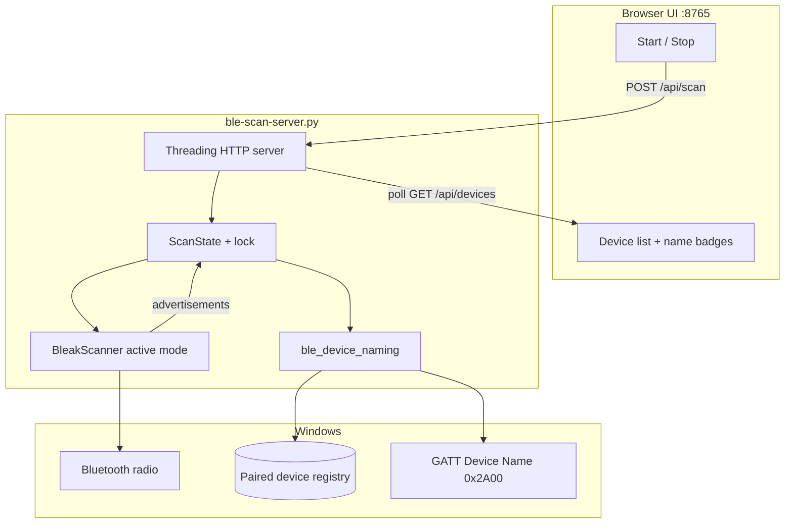
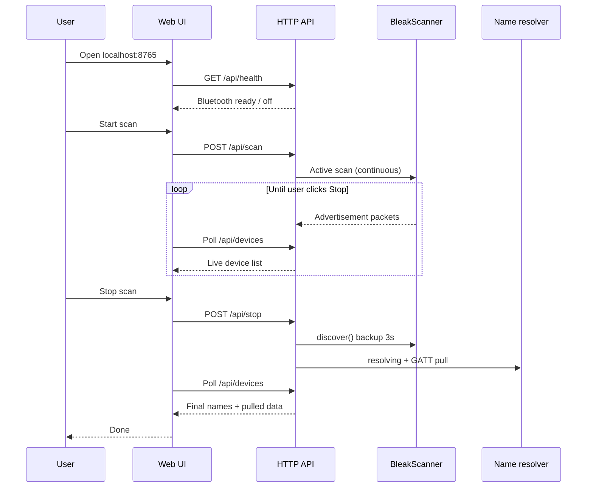
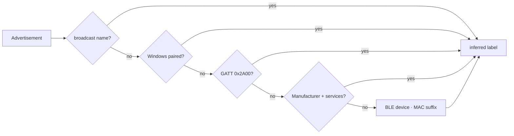
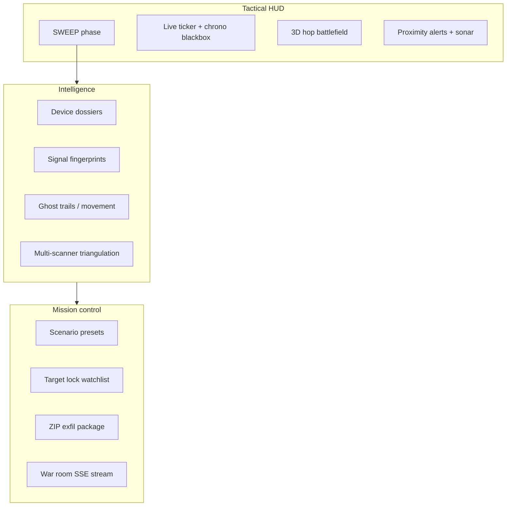
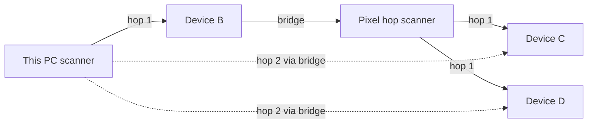
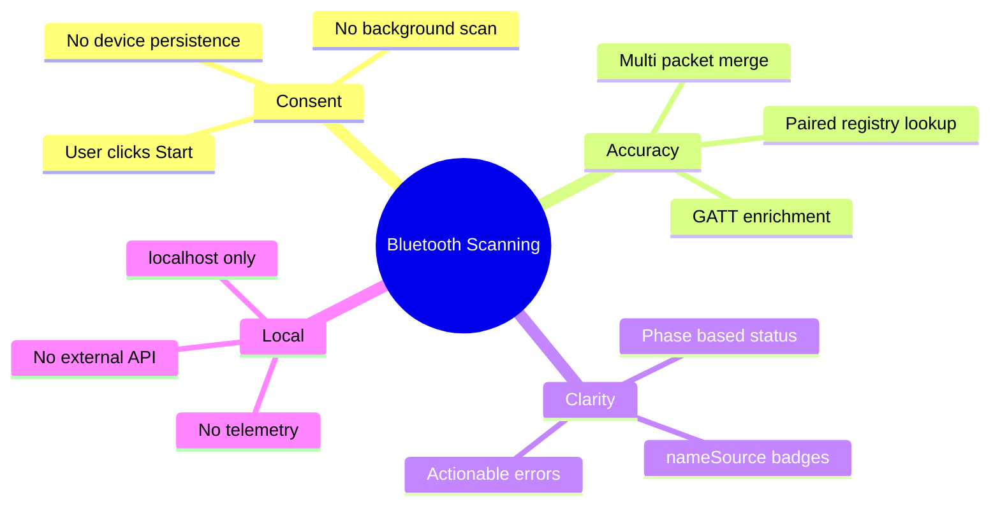

<div align="center">

# Bluetooth Scanning

**#houseofasher tactical BLE discovery — sci-fi HUD, domino hop chains, and honest device naming.**

[](requirements.txt)
[](#)
[](#)
[](#tactical-operations-houseofasher)
[](#license)

[Quick Start](#quick-start) · [Tactical HUD](#tactical-operations-houseofasher) · [Hop map](#hop-map-domino-discovery) · [API](#api) · [Troubleshooting](#troubleshooting)

**Repos:** [shep95/bluetooth-scanning](https://github.com/shep95/bluetooth-scanning) · [houseofasher/bluetooth_software](https://github.com/houseofasher/bluetooth_software)

</div>

---

## Overview

**Bluetooth Scanning** is a consent-based, local-first BLE scanner for Windows. It discovers nearby Low Energy devices through the OS Bluetooth stack (via [bleak](https://github.com/hbldh/bleak)), resolves human-readable names from multiple sources, and serves a live dashboard at `http://127.0.0.1:8765`.

| | |
|---|---|
| **Scan model** | Start runs continuously until **ABORT** — live tactical contact list |
| **HUD** | Mission phases, chrono blackbox, 3D hop battlefield, proximity alerts, sonar audio |
| **Naming** | Broadcast → paired registry → GATT → inference → MAC suffix |
| **Stack** | Python · bleak · WinRT · Three.js HUD · optional TypeScript client |
| **Privacy** | Runs on localhost; no cloud, no persistence, no tracking |

---

## Architecture



---

## Scan workflow



---

## Naming pipeline

Many BLE devices never broadcast a name. This project resolves **display names** in strict priority order:



| Priority | Source | Example | Badge |
|:---:|:---|:---|:---|
| 1 | **broadcast** | `Galaxy Buds` | `advertised` |
| 2 | **paired** | `Pixel 9` (Windows registry) | `paired` |
| 3 | **gatt** | Read from Device Name characteristic | `GATT name` |
| 4 | **inferred** | `Apple · Battery + HID` | `inferred` |
| 5 | **address** | `BLE device · A4:93:C6` | `address only` |

---

## Quick start

### Prerequisites

- **Windows 10/11** with Bluetooth adapter
- **Python 3.10+**
- Bluetooth **ON**
- Windows **Location** enabled (required for BLE scan on many builds)

### Install & run

```bash
git clone https://github.com/houseofasher/bluetooth_software.git
# or: git clone https://github.com/shep95/bluetooth-scanning.git
cd bluetooth-scanning  # or bluetooth_software
pip install -r requirements.txt
python ble-scan-server.py
```

Open **http://127.0.0.1:8765** — sweep **auto-starts** and runs forever (no device-count stop). Domino hop graph refreshes every 5s.

For multi-hop chains, run a companion in a loop:

```bash
# Phone / second PC as hop bridge
python hop_reporter.py --loop --node-id pixel-hop --label "Pixel 9" \
  --self-address C0:1C:6A:A4:93:C6 --server http://YOUR_PC_IP:8765

# Fixed listening post (dead drop)
python hop_reporter.py --loop --listening-post --node-id post-1 --label "Listening Post A" \
  --server http://YOUR_PC_IP:8765
```

---

## Tactical operations (#houseofasher)

Sci-fi action layer on top of real BLE physics. Every feature maps to honest radio behavior — no fake X-ray or stranger relay.



### Narrative → flaw → fix

| Sci-fi theory | Raw flaw | #houseofasher fix |
|---|---|---|
| Tactical HUD sees everything | RSSI is fuzzy, not GPS on targets | Distance rings + threat tiers from real signal data |
| Track emitters through MAC rotation | BLE randomizes MAC while advertising | **Signal fingerprints** hash manufacturer + UUIDs + pattern |
| Devices “approaching” silently | Single RSSI snapshot lies | **Ghost trails** trend approaching / receding / holding |
| Perimeter breach alarm | Any strong signal would spam | Scenario presets + optional **watchlist-only** mode |
| Electronic jamming | Can't detect real jammers cheaply | **Spectrum noise** heuristic when contact count collapses |
| Triangulate enemy position | Phones don't report GPS to your scanner | **Multi-scanner RSSI fusion** along hop topology only |
| Domino infinite range | Strangers won't relay for you | Cooperative **hop_reporter.py** nodes only |
| Download mission intel | Scattered UI state | **EXFIL PACKAGE** zip: devices, dossiers, chrono, hop graph |
| Command center wall display | Polling is choppy | **SSE war room stream** at `/api/events/stream` |

### Extended sci-fi theories (`ble_sci_fi.py`)

| Theory | Flaw | Fix in code |
|:---|:---|:---|
| Emitter cloning | Random MACs | `cloneClusters` via fingerprint history |
| Spoof / mimic | Generic names | `spoofAlerts` when watchlist name ≠ signature |
| Resurrection | Idle devices vanish | `SIGNAL LOST` / `RESURRECTED` chrono |
| Beacon dialect | No standard payload | `dialect` tags from UUID rules |
| Vector pursuit | RSSI noise | `pursuit.bearing` + confidence |
| Containment geofence | No target GPS | RSSI perimeter breach on scanner zone |
| Shadow tracking | Needs hop nodes | `shadowPath` across domino graph |
| Echo ranging | BLE ≠ sonar | Multi-node RSSI delta trend |
| Mesh quorum | One radio lies | `CONFIRMED` when ≥2 scanners agree |
| Scanner custody | No target GPS | `custodyChains` handoff log |
| Dead drop posts | Need hardware | `hop_reporter.py --listening-post --loop` |
| Mission replay | Live view fleeting | `replayFrames` buffer + HUD scrubber |
| Protocol fingerprint | Limited passive data | `protocol` profile from adv bytes |
| Co-occurrence cohorts | Co-location ≠ bond | `cohortClusters` matrix |
| Battery oracle | Battery often hidden | GATT level or adv cadence inference |
| Cipher exfil | Plain ZIP leaks | `/api/extract?format=cipher&password=` |
| Tomography grid | Not X-ray | Multi-scanner RSSI heat map |
| Device mind reading | Can't read thoughts | `mind.capabilities` from GATT/UUIDs |
| Worm spread | Strangers won't relay | `wormTimeline` hop depth over time |
| Temporal anomaly | Graph reorders | Impossible hop depth jump flag |
| Mission brief | JSON unreadable | `GET /api/brief` auto after-action report |
| Threat board | Too many contacts | Rotating priority board in HUD |
| Voice commander | — | Web Speech: "sync hops", "status", "brief" |
| Red/blue team | — | Ally=blue, unknown=red, target=purple |
| Quantum decoherence | — | UI glitch when interference = critical |

### Mission phases (UI labels)

| Phase | HUD label | Meaning |
|:---|:---|:---|
| `idle` | STANDBY | Ready |
| `running` | SWEEP | Continuous scan |
| `resolving` | DECRYPT | Name merge after ABORT |
| `pulling` | EXFIL | GATT intelligence pull |
| `completed` | MISSION COMPLETE | Results final |
| `failed` | SIGNAL LOST | Radio error |

### Scenario presets

| ID | Use case |
|:---|:---|
| `standard` | Balanced sweep + GATT exfil |
| `perimeter` | Aggressive proximity alerts, light pull |
| `asset_recovery` | Watchlist alerts, deep pull |
| `silent_observe` | No GATT connect, passive only |
| `deep_pull` | Maximum GATT exfil after ABORT |

### Tactical API (new)

| Method | Path | Description |
|:---:|:---|:---|
| `GET` | `/api/tactical` | Mission state, alerts, relay scores, domino breaches |
| `GET` | `/api/chrono` | Chrono blackbox events |
| `GET` | `/api/dossier?address=` | Full intel card for one device |
| `GET` | `/api/extract?format=zip` | Download mission exfil package |
| `GET` | `/api/extract?format=cipher&password=` | Password-scrambled exfil ZIP |
| `GET` | `/api/brief` | Plain-text mission after-action brief |
| `GET` | `/api/replay` | Time-dilated replay frame buffer |
| `GET` | `/api/theories` | Full narrative → flaw → fix catalog |
| `GET` | `/api/events/stream` | SSE war room event stream |
| `POST` | `/api/scenario` | Set mission preset `{ "scenario": "perimeter" }` |
| `POST` | `/api/watchlist` | Target lock `{ "address": "...", "action": "toggle" }` |

---

### TypeScript client (optional)

```typescript
import { BluetoothClient } from "./bluetooth-client";

const client = new BluetoothClient();
await client.setScenario("perimeter");

const scan = await client.startScan({
  onUpdate: (s) => console.log(s.missionLabel, s.tactical?.ticker, s.count),
});

await scan.stop();
window.location.href = client.extractionUrl("zip");
```

---

## Hop map (domino discovery)

**Theory:** Device 1 sees Device 2, Device 2 sees Device 3 — a domino chain that extends discovery beyond one radio.

**Reality:** Only **cooperative scanners** you register can hop. Strangers' phones do not relay.



### Run the hop chain

1. Start the server and **Start scan** on your PC (root scanner).
2. On another machine or phone hotspot network, run a **hop reporter**:

```bash
# Example: Pixel as hop node 2 (use your PC's LAN IP if remote)
python hop_reporter.py --node-id pixel-hop --label "Pixel 9" \
  --self-address C0:1C:6A:A4:93:C6 \
  --server http://192.168.1.10:8765
```

3. Open the dashboard **Hop map** section — chains show `This PC → Pixel 9 → …`.

| Flaw (raw theory) | Fix (this build) |
|---|---|
| Unlimited passive hops through strangers | Only registered `hop/report` nodes |
| Infinite distance | Each hop is still ~10–30 m radio; more hops = more of your scanners |
| One scanner sees all | Server merges graphs from PC + companions |

---

## Project layout

```
bluetooth-scanning/
├── ble-scan-server.py      # HTTP server + scan orchestration
├── tactical_hud.html       # #houseofasher tactical HUD (loaded at runtime)
├── ble_tactical.py         # Chrono, fingerprints, trails, scenarios, exfil
├── ble_sci_fi.py           # Extended theory engine (21+ narrative→fix modules)
├── ble_hop_graph.py        # Cooperative domino hop graph + relay scores
├── hop_reporter.py         # Companion scanner CLI (hop node)
├── ble_device_naming.py    # Multi-source name resolution
├── ble_enrichment.py       # Distance, location, tactical merge
├── bluetooth-client.ts     # TypeScript API client
├── requirements.txt
└── README.md
```

---

## API

| Method | Path | Description |
|:---:|:---|:---|
| `GET` | `/` | Web dashboard |
| `GET` | `/api/health` | Preflight Bluetooth radio check |
| `GET` | `/api/devices` | Scan snapshot (`phase`, `devices`, `count`) |
| `POST` | `/api/scan` | Start continuous scan (503 if Bluetooth off); returns `{ "continuous": true }` |
| `POST` | `/api/stop` | Stop scan — triggers discover backup, name resolve, and GATT pull |
| `GET` | `/api/hop/graph` | Domino hop graph (nodes, edges, chains) |
| `POST` | `/api/hop/report` | Companion scanner submits observations |

### Device object

```json
{
  "id": "C0:1C:6A:A4:93:C6",
  "displayName": "Pixel 9",
  "nameSource": "paired",
  "broadcastName": null,
  "manufacturer": "Google",
  "rssi": -62,
  "uuids": ["0000180f-0000-1000-8000-00805f9b34fb"]
}
```

### Scan phases

| Phase | Meaning |
|:---|:---|
| `idle` | Ready for new scan |
| `running` | Collecting advertisements (runs until Stop) |
| `resolving` | Name merge after Stop |
| `pulling` | GATT data pull after Stop |
| `completed` | Results final |
| `failed` | Bluetooth or scan error |

---

## Troubleshooting

<details>
<summary><strong>Health check says Bluetooth is OFF</strong></summary>

Settings → **Bluetooth & devices** → turn Bluetooth **On**, then refresh the page.
</details>

<details>
<summary><strong>Scan completes with 0 devices</strong></summary>

1. Confirm health banner is green  
2. Enable **Location** in Windows Settings → Privacy  
3. Ensure a BLE device is nearby and advertising (phone, watch, headphones)  
4. Stay within ~10 m of the device
</details>

<details>
<summary><strong>Devices show inferred names instead of real names</strong></summary>

That device is not broadcasting its name and is not paired with this PC. Pair it in Windows Bluetooth settings, or rely on GATT resolution (automatic for the strongest unresolved devices).
</details>

<details>
<summary><strong>Port 8765 already in use</strong></summary>

```bash
# Windows PowerShell
Get-NetTCPConnection -LocalPort 8765 | ForEach-Object { Stop-Process -Id $_.OwningProcess -Force }
```
</details>

---

## Design principles



---

## License

MIT — see [LICENSE](LICENSE).

---

<div align="center">

**#houseofasher** · [shep95/bluetooth-scanning](https://github.com/shep95/bluetooth-scanning) · [houseofasher/bluetooth_software](https://github.com/houseofasher/bluetooth_software)

Tactical BLE discovery for Windows — honest naming, real radio physics, sci-fi presentation.

</div>
